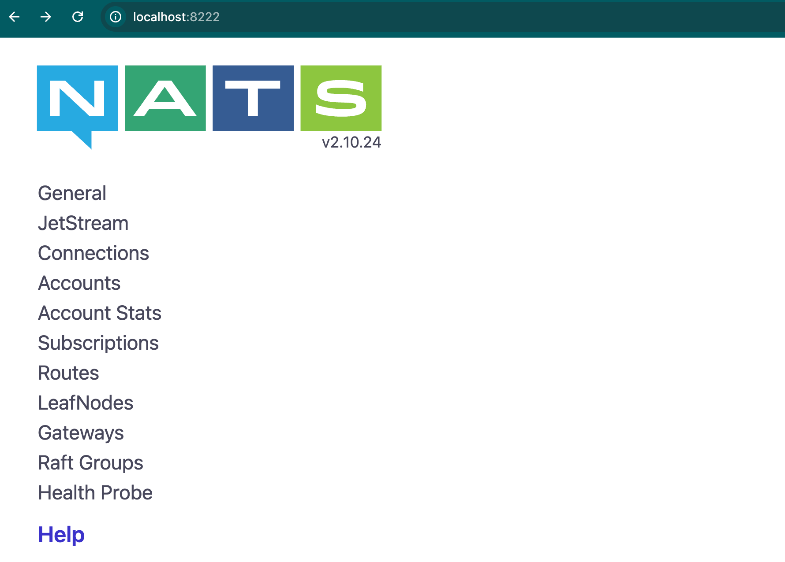

# FaaS Project

## Description

## Launching options
### Preparation
First build the docker images:
```bash
docker build -t auth-service:latest ./auth-service
docker build -t registry-service:latest ./registry-service
docker build -t spawner-service:latest ./spawner-service
```

### Docker compose deployment
To deploy the services using docker compose, simply run the following command:
```bash
docker compose up
```
To scale services, simply add the `--scale` flag to the command:
```bash
docker compose up --scale auth-service=<number> --scale registry-service=<number> --scale execution-service=<number>
```

### Swarm deployment
To use swarm, first initialize the swarm, then deploy the stack:
```bash
docker swarm init
docker stack deploy -c docker-compose.yml faas
```

To manually scale services in swarm, use the `docker service scale` command:
```bash
docker service scale faas_auth-service=<number> faas_registry-service=<number> faas_execution-service=<number>
```

To remove the swarm stack, use the `docker stack rm` command:
```bash
docker stack rm faas
```

## Modules
- The auth service is available INTERNALLY at http://auth-service:8080, EXTERNALLY at http://x.x.x.x:4000.
- The registry service is available INTERNALLY at http://registry-service:8081, EXTERNALLY at http://x.x.x.x:5000.

### APISIX
I have no freaking clue of what this does or how it works, we'll explore it.

### API Gateway
The entrypoint to all the services, this is the only service that is exposed to the outside world.

- [ ] Define the API functionalities
- [ ] Implement rerouting to Auth service
- [ ] Implement rerouting to Registry service
- [ ] Implement connection to NATS Messaging service

### Auth service
User auth & registration

Details can be found here: [Auth service](auth-service/README.md)

### Registry service
Registering & unregistering functions
- [x] Register function
- [x] Unregister function
- [x] Get function by id
- [x] Get all functions for user
- [x] Update function by id

Details can be found here: [Registry service](registry-service/README.md)

### Spawner service
It executes functions by spawning workers as containers from an image reference and a string argument.

Details can be found here: [Spawner service](spawner-service/README.md)

### NATS
#### Monitoring at localhost:8222


# Limitations
Since function activations are synchronous, it has certain limitations
* If message queue is long, then the HTTP request may timeout.
* If a function has a long execution, then the HTTP request may timeout and would affect other users as well. 
