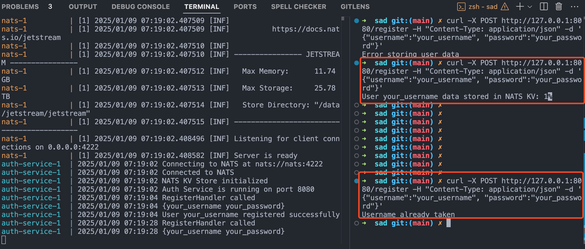

# FaaS (Function as a Service)

A simple Go-based project using Gorilla Mux for routing, JWT for authentication, and bcrypt for password hashing.

- NATS KV as database.

- To start the project, run
  `docker-compose up`

- If needed, download dependencies
  Download required dependencies:

```
go mod download github.com/golang-jwt/jwt/v4
go mod download github.com/gorilla/mux
go mod download github.com/nats-io/nats.go
go mod download github.com/google/uuid
```

- Secret for JWT tokens is generated automatically by Dockerfile.
- To set a new secret for JWT token:
  `export JWT_SECRET=your_secret`

# Test the API

## CURL examples
### Register
```
curl -X POST http://localhost/auth/register -H "Content-Type: application/json" -d '{"username":"your_username", "password":"your_password"}'
```

### Login
```
curl -X POST http://localhost/auth/login -H "Content-Type: application/json" -d '{"username":"your_username", "password":"your_password"}'
```

### JWT token validation
```
curl http://localhost/auth/validate -H "Authorization: <token>"
```


